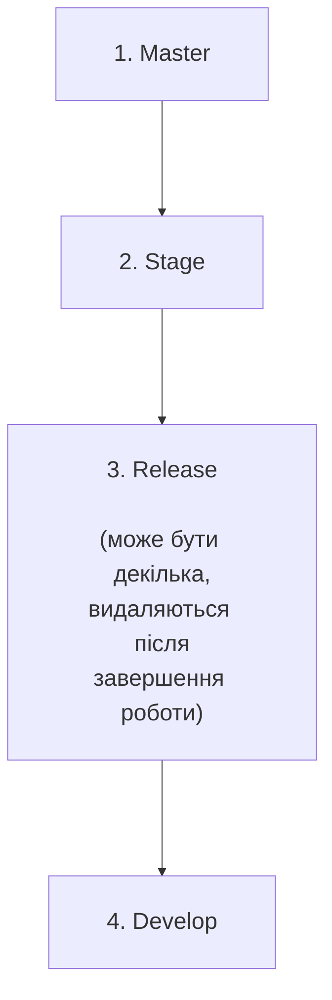

# Branching Strategy & Development Workflow

## 1. Основна розробка

Основна розробка ведеться в `Develop` вітці.

---

## 2. Feature / Fix / Chore вітки

Для кожної нової фічі створюється `Feature` вітка  
(для фікса — `Fix` вітка, для мейнтейн змін — `Chore` тощо).

Після того як фіча (фікс) буде зробленою:

- відбувається merge `Feature` вітки в `Development`
- після merge `Feature` вітка видаляється

---

## 3. Release вітка

Якщо необхідно працювати над фічами для наступного релізу — доцільно виносити це в окрему вітку `Release`.

Це необхідно для того щоб велась паралельна робота над:

- development ticket'ами
- ticket'ами, які попадуть в наступний реліз

Коли розробка релізної версії завершена:

1. першим етапом регрешену потрібно здійснити merge вітки `Release` в вітку `Stage`
2. після merge `Release` вітка видаляється
3. робимо merge `Stage` вітки в `Development`

---

## 4. Stage вітка

`Stage` вітка використовується для змін під час проведення регрешену.

Після того як робота над регрешеном закінчена:

1. `Stage` вітка merge'иться в `Master`
2. `Master` merge'иться в `Develop`
3. `Master` merge'иться також в `Release` вітку (якщо така існує)
4. тегується commit в `Master` версією релізу (annotated tag)

---

## 5. Master вітка

Вітка `Master` містить в собі зміни релізнутої версії продукту.

---

## 6. Hotfix

Якщо потрібно зробити хотфікс:

1. створюється вітка з `Master`, яка називається `Hotfix`
2. вся робота над фіксом ведеться в цій вітці
3. коли робота завершена — `Hotfix` merge'иться в `Master`
4. `Master` merge'иться в `Stage`
5. `Master(Stage)` merge'иться в `Develop`
6. також merge відбувається в `Release` вітку (якщо така існує)
7. тегується commit в `Master` версією релізу

---

## Ієрархія віток

## Важливо

1. Якщо були зроблені якісь зміни у вітці що стоїть вище по ієрархії, наприклад в master, то ці зміни необхідно змерджати у вітки які стоять нижче в цій ієрархії.

- Виключним випадком є вітка (вітки) Release, оскільки ми їх видаляємо коли зміни з цієї вітки потрапляють на Stage. Але, якщо ми маємо вітку Release яка є не видалена, тобто на ній ведеться робота паралельно, то ми маємо завжди мерджити зміни в цю вітку (вітки), відповідно до ієрархії.

2. Внесення будь-яких змін в вітки що перелічені в ієрархії вище відбувається тільки через merge реквести.

- Тобто ви маєте працювати над своїми змінами в окремій вітці створеної від основної (Master, Stage, Release, Develop), тобто в своїх власних Feature/Fix вітках.